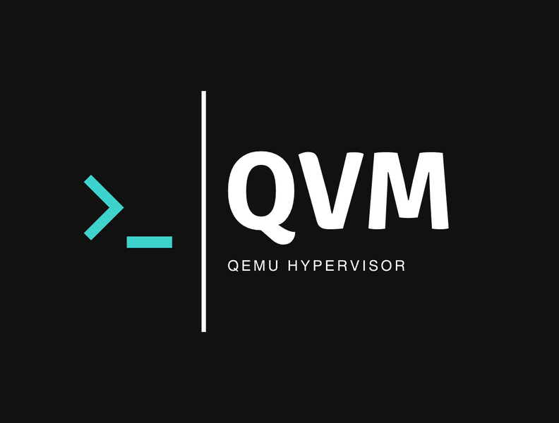

# QVM-Manager (QEMU Virtual Machine Manager)



# QVM Manager - v1.0.4 - beta © 2024 P.H.

## Table of Contents

1. [Project Overview](#overview)
2. [Dev Message](#dev-message)
3. [Features](#features)
4. [Installation Guide](#installation)
5. [Requirements](#requirements)
6. [Usage](#usage)
7. [Configuration](#configuration)
8. [Contributing](#contributing)
9. [License](#license)

## Overview

This project implements a Type 2 hypervisor for Linux-based `x86_64` systems using `QEMU (Quick Emulator)` written in `Bash`. `QVM` is designed to facilitate the effecient use of QEMU which is a generic and open-source machine emulator and virtualizer that allows guest operating systems to run as an application on top of an existing operating system. This implementation focuses on providing a user-friendly, efficient, and flexible virtualization solution for various guest operating systems.

***Note: The `QVM` project is now focused on the implementation of `v1.0.4`.** For more information see the projects [Roadmap](https://github.com/RoyalHighgrass/QVM-Manager/blob/main/QVM/CONTRIBUTING.md#development-roadmap).*

## Dev Message
### Dear Virtualization Community,

As a long-time Linux user and VM enthusiast, I've encountered numerous challenges in running virtual machines on Linux. These experiences inspired me to create QVM, a new virtualization solution that addresses common pain points. Over the years, I've experimented with various hypervisors and virtualization software on Linux systems. While Windows users have Hyper-V and VMware Workstation, and macOS users have Parallels and VMware Fusion, Linux users have traditionally relied on VirtualBox, Gnome Boxes and Virt-Manager, with the latter two being my go to virtualisation tools, each used for a specific aspect of managing VM's as I generally avoid using VirtualBox.

In autumn 2024, I discovered that virt-manager was deprecated, which explained some recent frustrations. This realization, coupled with the lack of a suitable alternative, motivated me to develop QVM. My goal was to combine the best features of virt-manager and GNOME Boxes to create a compelling alternative for Linux virtualization needs. Interestingly, after creating QVM, I came across a 2018 paper by Dr. Emmanuel Ogunshile, who had proposed a similar concept called "qvm: A command line tool for the provisioning of virtual machines". While Ogunshile's qvm was developed in Python and utilized YAML for configuration, the QVM I unknowingly created was implemented in Bash. This coincidental parallel development highlights the ongoing need for efficient virtualization tools in the Linux community.

### QVM Features

- **Core Technology**: QVM is built on QEMU and is supported by KVM, providing powerful, hardware-assisted virtualization.
- **Streamlined Interface**: Unlike libvirt, QVM interfaces directly with QEMU for a more efficient experience.
- **User-Friendly**: QVM offers both a lightweight CLI and a user-friendly GUI for managing virtual machines.

### The Project

As my first truly open-source software development project, developing QVM has been an enlightening experience. Overcoming various challenges has deepened my understanding of the emulation processes and boosted my confidence in tackling complex projects.

I hope QVM will become a valuable tool for the virtualization community. Your feedback and contributions are welcome as I continue to improve and expand its capabilities.

Happy virtualizing!

### P.H.
QVM Developer

## Features

- **Multiple OS Support**: Run various Linux-based guest operating systems, including Debian, ArchLinux, Kali Linux, Ubuntu, RaspiOS, and other specialized systems.
- **Lightweight & Effecient**: `QVM` is a sleek & efficient `Type 2 hypervisor` that leaves minimal footprint while maximising performance with seamless integration across platforms.
- **Hardware Emulation**: Emulate a wide range of hardware devices, including CPUs, network cards, and storage devices.
- **Disk Image Management**: Utilizes the `qcow2` format for efficient disk space usage and snapshot capabilities. `raw`, `vdi`, `vmdk` & `vhd` formats can also be used.
- **VM Templating**: Create and manage VM templates for quick and efficient replication of virtual machines.
- **Memory Management**: Configure and optimize VM memory usage with various backend options.
- **NUMA Support**: Enable `Non-Uniform Memory Access (NUMA)` for improved performance in multi-processor systems.
- **KVM & VGA Support**: Enable `Kernel-based Virtual Machine` support and use KVM virtualization features to further enhance performance. `VGA` graphics display drivers can be used instead of default QEMU graphics drivers for specialised use-cases.

## Installation

**Note**:`QVM (QEMU Virtual Machine Manager) - v1.0.3` is currently in a testing phase, with confirmed functionality on `Kali Linux` systems. While the tool itself operates stably once properly configured, users should be aware that the installation process can be sensitive to different environments. The primary challenge lies in `the interpretation of bash scripts by various shell environments`. As a result, `QVM` may not function correctly outside of a `bash shell environment`. Users attempting to install or run QVM on other systems or in other shell environments may encounter unexpected issues or failures.

Therefore, I recommend using a `bash shell` when running `QVM` for the best experience. I am actively working to improve compatibility across different platforms and shells and hope for this to be resolved in the official `v1.0.4` release. For more information see the [QVM Issues](https://github.com/RoyalHighgrass/QVM-Manager/issues) page. If you experience any issues while running QVM inside a bash environment, please do raise an issue about it as it will allow me to make the code more robust.

#### Installation Guide
This application is primarily developed and tested on a Kali Linux system.

See [here](https://github.com/RoyalHighgrass/QVM-Manager/issues/11#issuecomment-2606083067) for more information about which systems QVM has been tested on.

***Note: It is recommended that you always install the latest stable version of QVM.***

To install the in-development beta version of `QVM-Manager v1.0.4`, use the following command:

First, make sure that your system is up-to-date & that `git` & `curl` are installed & also up-to-date.

Using `apt`:
```
sudo apt update && sudo apt upgrade -y
sudo apt install git curl -y
```
Using `pacman`:
```
sudo pacman -Syu --noconfirm
sudo pacman -S git curl --noconfirm
```


Then...

```
curl -fsSL https://raw.githubusercontent.com/RoyalHighgrass/QVM-Manager/main/QVM/config.sh | bash
```
To install the latest stable version of `QVM-Manager`, use the following command.

Using `apt`:
```
sudo apt update
sudo apt install -y wget tree locate zenity wmctrl make autoconf gawk acpi bc \
   cmake intltool bridge-utils mgba-sdl mesa-utils elinks yad \
   cpu-checker original-awk mawk libgtk-3-common libgtk-3-dev cgroup-tools \
   libvirt-clients libvirt-daemon-system virtinst libvirt-daemon qemu-kvm automake \
   intltool qemu-system-common qemu-system-arm qemu-system-x86 qemu-efi-aarch64 \
   libsdl2-2.0-0 libsdl2-net-2.0-0 mednafen build-essential mesa-vulkan-drivers \
   libwebkit2gtk-4.0-doc libgspell-1-dev libgtksourceview-3.0-dev libwebkit2gtk-4.0-dev
```
Using `pacman`:
```
sudo pacman -Syu --noconfirm
sudo pacman -S wget tree locate zenity wmctrl make autoconf gawk acpi bc \
   cmake intltool bridge-utils mgba-sdl mesa-utils elinks \
   cpu-checker original-awk mawk libgtk-3-common libgtk-3-dev cgroup-tools yad gtk-layer-shell \
   gtk3 gtk3-docs gtk3-demos gtk4 gtk4-docs gtk4-demos libportal-gtk3 libportal-gtk4 \
   libindicator-gtk3 libvirt libvirt-dbus libvirt-glib \
  libguestfs virt-firmware vulkan-virtio gcc libdaemon qemu-full qemu-guest-agent
    qemu-system-arm qemu-system-aarch64 glbinding mesa vulkan-mesa-layers sdl2 --noconfirm
``````

Then...

```
cd /tmp/
wget https://github.com/RoyalHighgrass/QVM-Manager/archive/refs/tags/v1.0.3-stable.zip
unzip v1.0.3-stable.zip
cd QVM-Manager-1.0.3-stable/QVM/
chmod +x config.sh
./config.sh
```
Not using `apt` or `pacman`?
###### **Note**: If you are not using `apt` or `pacman` as your package manager, you will have to install all required packages mannually before running the `./QVM/config.sh` command which should ask you if you have done so and are ready to proceed. 
Proceeding without manually installing all necessary packages will cause the installation to fail.

###### **Note**: Once the installation is complete, the `QVM` icon should automatically appear in your systems application menu and application search results. In the event that this does not happen, you will most likely need to either; run the '`sudo update-desktop-database`' command or restart your system, possibly both.

To uninstall `QVM-Manager`, you can use the following command:
```
qvm-manager --uninstall
```

## Requirements

If you're using a package manager other than `apt` or `pacman`, you'll need to manually install all the required packages and will most likely have to find suitable alternatives if the exact package isn't available via your preferred package manager. 

Additional packages of your choosing can be added as needed for enhanced functionality.
###### **Note**: A required package may simply be a component of another package, meaning that you'll need to install the parent package to access its components.
```
wget
tree
cut
original-awk 
mawk 
gawk 
find
locate
zenity
wmctrl
make
cpu-checker
intltool 
autoconf 
gtk-layer-shell-doc 
gtk4-layer-shell-doc 
libgtk-3-common 
libgtk-4-common 
libgtk-3-0t64 
libgtk-3-dev 
yad (pacman/github)
acpi
bc
cgroup-tools
libvirt-clients 
libvirt-daemon-system 
bridge-utils 
virtinst 
libvirt-daemon
libvirt-clients-qemu
qemu-kvm 
qemu-system-common
qemu-system-arm
qemu-system-x86
qemu-efi-aarch64
qemu-system-modules-opengl
qemu-utils
grub-firmware-qemu
mgba-sdl
libsdl2-2.0-0
libsdl2-net-2.0-0
mednafen
```

## Usage

Start QVM's CLI interface:
```
qvm-manager
```
Launch GUI interface:
```
qvm-manager --gui
```
Get version info:
```
qvm-manager --version
```
Show help message:
```
qvm-manager --help
```
Save a VM snapshot:
```
qvm-manager --snap <vm_name> --tag <snapshot_name>
```
Roll back a VM to a previous state:
```
qvm-manager --revert <vm_name> --tag <snapshot_name>
```

For more advanced usage and configuration options, please refer to the [User Manual](QVM/User_Manual_-_QVM_Documentation.txt) documentation.

## Configuration

The hypervisor VM specifications can easily be configured using command-line application interface, and templating can be implemented via the graphical user interface. Some key configuration areas include:

- Memory allocation
- CPU cores used
- Network interfaces
- Display drivers
- Audio interfaces
- KVM & VGA intergration
- Virtual hardware
- Storage devices
- Shared memory
- Host keyboard sharing

## Contributing

Contributions to the project are welcome! Please read the [CONTRIBUTING.md](QVM/CONTRIBUTING.md) file for guidelines on how to submit pull requests, report issues, and suggest improvements.

## License

This project is licensed under the GNU General Public License v3.0. See the [LICENSE](QVM/LICENSE) file for more details.


